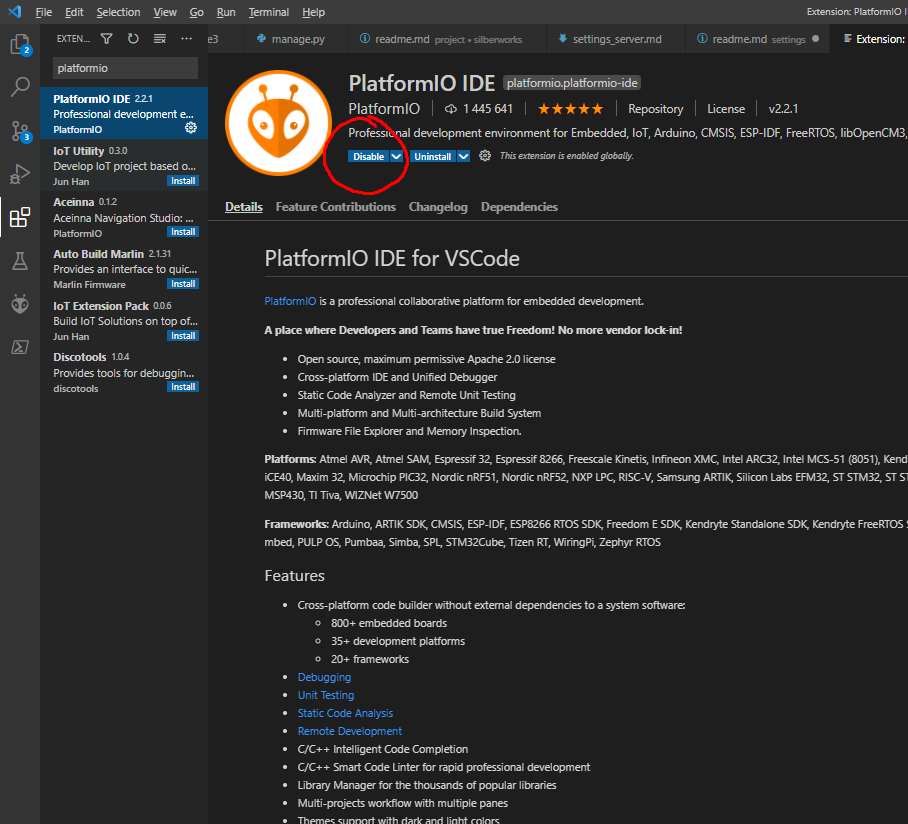
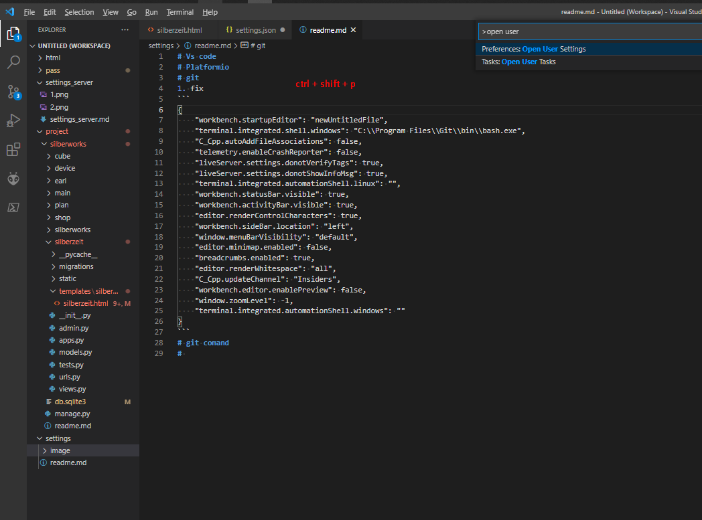
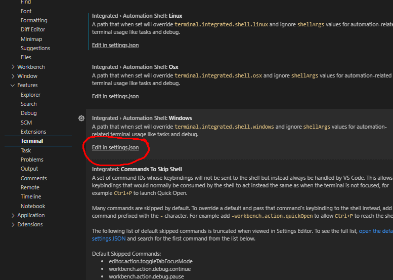
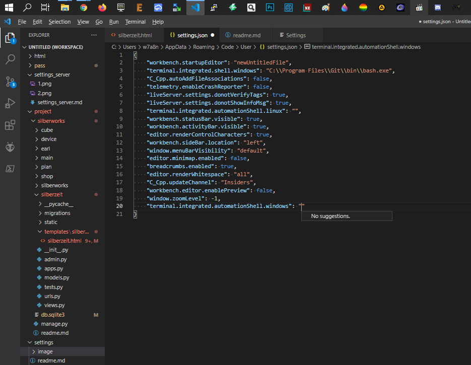

# Vs code
## Скачать
[vs code](https://code.visualstudio.com/)

# Platformio

## Скачать



# git
## Скачать 
[git scm](https://git-scm.com/download/win/)

## fix


```
open user s
```



```
{
    "workbench.startupEditor": "newUntitledFile",
    "terminal.integrated.shell.windows": "C:\\Program Files\\Git\\bin\\bash.exe",
    "C_Cpp.autoAddFileAssociations": false,
    "telemetry.enableCrashReporter": false,
    "liveServer.settings.donotVerifyTags": true,
    "liveServer.settings.donotShowInfoMsg": true,
    "terminal.integrated.automationShell.linux": "",
    "workbench.statusBar.visible": true,
    "workbench.activityBar.visible": true,
    "editor.renderControlCharacters": true,
    "workbench.sideBar.location": "left",
    "window.menuBarVisibility": "default",
    "editor.minimap.enabled": false,
    "breadcrumbs.enabled": true,
    "editor.renderWhitespace": "all",
    "C_Cpp.updateChannel": "Insiders",
    "workbench.editor.enablePreview": false,
    "window.zoomLevel": -1,
    "terminal.integrated.automationShell.windows": ""
}
```
# git command
## Основные

Инициализация

```
git init
```
Добавить все изменённые файлы в commit

```
git add . 
```

Сommit с коментом

```
git commit -m "new commit"
```
Переход в другой commit

```
git checkout hash
```
Новая ветка

```
git branch name
```

## Клонирование 

Tq0sV}6k08WLCm{Wk?{Xy5Y4nElsmEozKWP*?0uG

Проекты
```
git clone rtk@silberworks.com:/home/rtk/rtk/rtk_ds4_leonardo
git clone rtk@silberworks.com:/home/rtk/rtk/rtk_ds4_bluetouch_leonardo
git clone rtk@silberworks.com:/home/rtk/rtk/rtk_void_bluetouch_mega
git clone rtk@silberworks.com:/home/rtk/rtk/rtk_void_driver_168
git clone rtk@silberworks.com:/home/rtk/rtk/rtk_void_mega
```
Библиотеки
```
git clone rtk@silberworks.com:/home/rtk/rtk/silberworks_encoder
```
[thumper and iopins](https://github.com/incubus-ank/Wild_Thumper)